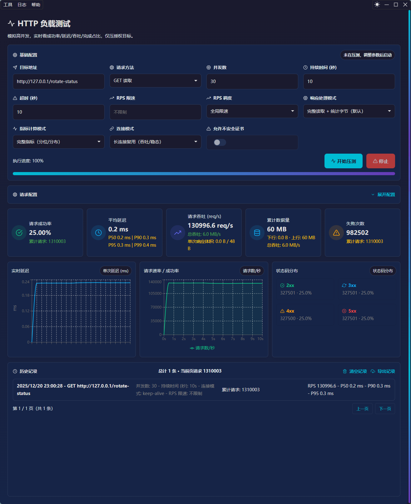
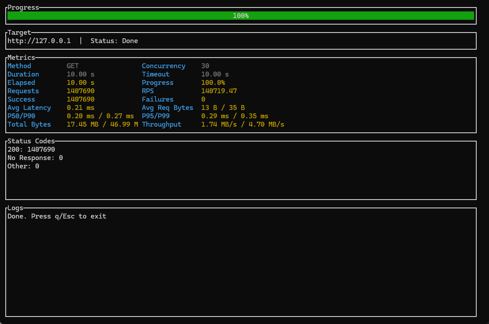

#  netlab 网络实验室

**netlab** 是一个面向工程师的 **网络行为实验、调试与验证平台**。

> 它的目标不是“跑出一个 QPS 数字”，而是 **构造、观察、理解真实的网络行为**。

* **负载测试说明（实现与演进）** 👉 [`LOAD_TEST.md`](./LOAD_TEST.md)

---

## 界面截图





---

## ✨ 项目定位

**netlab 专注于：**

* 网络行为构造（HTTP / TCP / TLS 等）
* 网络负载与连接模型实验
* 网络调试与边界行为复现
* 高精度指标采集与分析

**netlab 不是：**

* 单一 HTTP 压测工具
* GUI 优先项目
* 面向非技术用户的“一键工具”

---

## 🧠 设计理念（核心）

* **核心优先**：网络与调度逻辑独立于 UI
* **壳层可插拔**：CLI / GUI 都只是入口
* **行为可验证**：结果可复现、可解释
* **工程可演进**：不为短期功能牺牲架构

> GUI 可以没有，**engine 不能妥协。**

---

## 🏗️ 项目结构概览

```text
netlab/
├── crates/
│   ├── engine/        # ⭐ 核心网络引擎
│   ├── cli/           # 命令行入口（TUI CLI）
│   └── tauri/         # GUI 壳（可插拔）
├── src/          # 前端工程
├── ARCHITECTURE_V1.md # 架构宪法
├── CONTRIBUTING.md    # 贡献与约束规则
└── README.md
```

---

## 📌 核心模块说明

### engine（核心）

* 所有网络行为、调度、指标均在此实现
* 可独立运行
* 不依赖 GUI / CLI

👉 详见：[CLI 说明](crates/engine/README.md)

---

### Cli（命令行 / TUI）

* engine 的命令行入口（基于 ratatui 的 TUI CLI）
* 用于 headless / CI 场景

👉 详见：[Cli 说明](crates/cli/README.md)

---

### Gui / Tauri

* 本地桌面 GUI 壳
* 用于参数配置与可视化
* 内置日志中心窗口（跨功能日志订阅）
* 界面语言支持中文/英文/日文

👉 详见：[Gui 说明](crates/tauri/README.md)

---

## 📄 文档导航（必读）

* **架构设计** 👉 [`ARCHITECTURE_V1.md`](./ARCHITECTURE_V1.md)

* **贡献规则（强制）** 👉 [`CONTRIBUTING.md`](./CONTRIBUTING.md)

* **核心引擎说明** 👉 [`crates/engine/README.md`](./crates/engine/README.md)

---

## 🚦 当前开发阶段

> **当前阶段：engine 优先**

* 正在重点建设核心网络引擎
* CLI 已可用（TUI 形式）
* GUI 持续迭代

---

## 🤝 参与贡献

在提交任何代码前，请务必阅读：👉 **[`CONTRIBUTING.md`](./CONTRIBUTING.md)**

其中包含：

* 架构红线（Hard Rules）
* 模块职责边界
* 会被直接拒绝的改动类型

---

## 🦉 关于 netlab

netlab 更像一个 **网络实验室**，而不是一个“工具集合”。

它关注的问题是：

* 这个连接是如何建立的？
* 这个延迟从哪里产生？
* 这个行为是否符合协议预期？

如果你也关心这些问题，
netlab 欢迎你。

---

## 📜 License

（待定）

---
